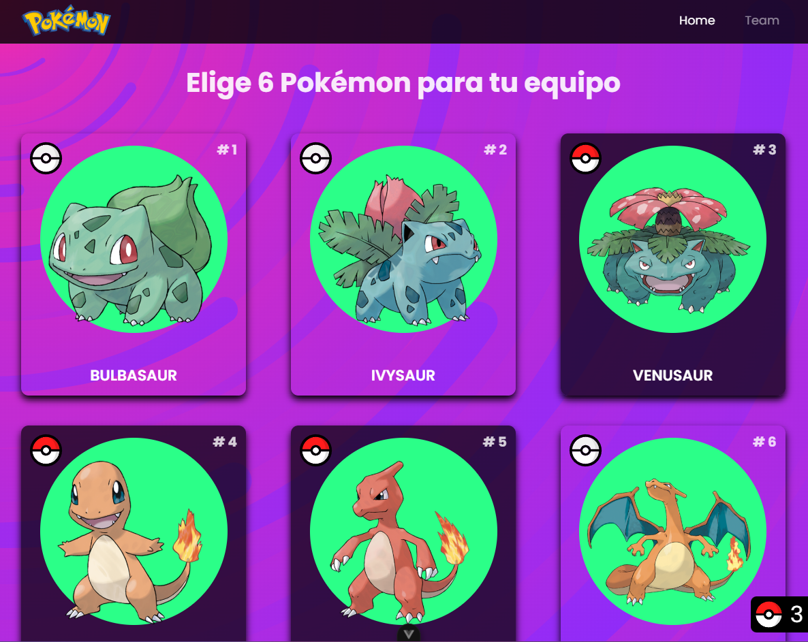
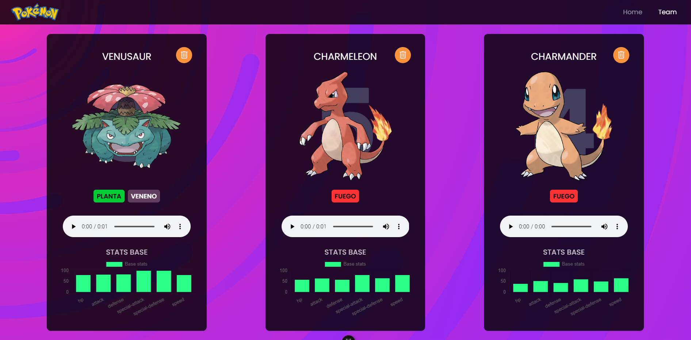

# Pokémon Team

¡Bienvenido a Pokémon Team! Este proyecto es una aplicación desarrollada con **Vue.js 3** y **Vite**, que incluye características como paginación con **TanStack Query** y manejo de estado global con **Pinia**.

## 🛠 Tecnologías utilizadas

- **Vue.js 3**: Framework progresivo de JavaScript.
- **Vite**: Herramienta de desarrollo rápida y moderna.
- **TanStack Query**: Librería para manejo de datos asíncronos y paginación.
- **Pinia**: Manejo de estado global fácil de usar y moderno.
- **TypeScript**: Para un desarrollo tipado más robusto.
- **Vitest**: Para pruebas unitarias.
- **ESLint**: Linter para mantener un código limpio y consistente.

---

## 🚀 Características principales

- **Paginación avanzada**: Implementada con **TanStack Query** para manejar de forma eficiente grandes volúmenes de datos.
- **Estado global**: Utiliza **Pinia** para un manejo centralizado y reactivo de los datos.
- **Tipado con TypeScript**: Mejora la productividad y previene errores en el código.
- **Desempeño óptimo**: Gracias a **Vite** como bundler.

---

## 📦 Configuración del proyecto

Sigue estos pasos para configurar y ejecutar el proyecto localmente:

### 1. Clona el repositorio

git clone https://github.com/tu-usuario/pokemon-team.git

### 2. Compila y recarga en modo desarrollo

npm run dev

### 3. Verifica el tipado y compila para producción

npm run build

### Analiza el código con ESLint

npm run lint

# Pokemon-Team

## 📸 Capturas de pantalla

**Vista principal de la aplicación**

